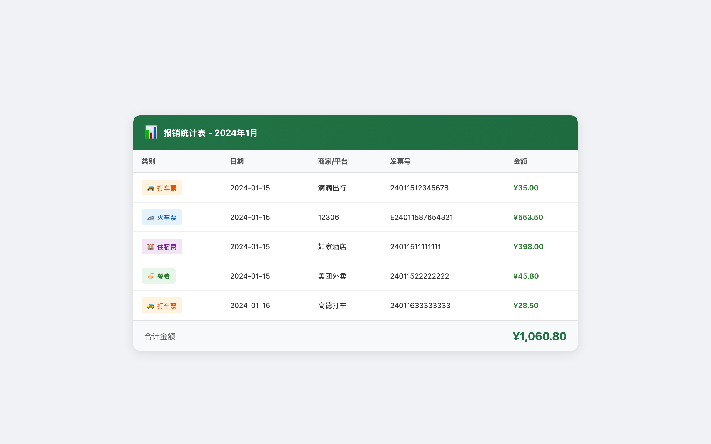

<div align="center">

# 报销助手
> AI 智能发票识别与报销整理工具 · AI-Powered Invoice Recognition & Reimbursement Assistant


### 扔进去 → 等一下 → 拿结果 · 让报销从此告别繁琐


[核心功能](#核心功能) • [Claude Code Skill](#claude-code-skill) • [下载安装](#下载安装) • [快速开始](#快速开始) • [技术架构](#技术架构)

__简体中文__ | [English](./README_EN.md)

---
</div>

## 项目简介

**报销助手** 是一款基于 AI 的智能发票识别与报销整理工具，专为经常出差、面对大量发票需要整理的职场人士设计。

每次出差回来面对一堆发票的头疼？让报销助手帮你自动完成！只需将发票图片或 PDF 拖入应用，AI 将自动识别发票类型、提取关键信息、智能配对关联文件，并生成可直接用于报销的 Excel 报表。

### 为什么选择报销助手？

| 传统方式 | 报销助手 |
|---------|---------|
| 手动整理发票，耗时费力 | AI 自动识别，秒级处理 |
| 容易遗漏、错配行程单 | 智能配对，精准关联 |
| Excel 手工录入，容易出错 | 自动生成报表，数据准确 |
| 多平台发票格式不统一 | 统一分类整理，规范输出 |

## 核心功能

### 1. 智能识别
支持多种发票格式，自动提取关键信息：

- **多格式支持**：JPG、PNG 图片、PDF 文档
- **全类型覆盖**：扫描件和电子发票都能处理
- **精准提取**：金额、日期、商家、发票号、税号等


### 2. 自动分类
AI 自动将发票归类到五大类别：

| 类别 | 识别范围 | 图标 |
|------|---------|------|
| 打车票 | 滴滴、高德、美团打车、曹操、首汽、出租车 | 🚕 |
| 火车飞机票 | 12306、各航空公司、携程、飞猪 | 🚄 ✈️ |
| 住宿费 | 酒店、宾馆、民宿（如家、汉庭、亚朵等） | 🏨 |
| 餐费 | 餐厅、外卖、美团、饿了么 | 🍜 |
| 其他 | 未能识别的发票 | 📦 |


### 3. 智能配对
打车经常有「行程单 + 发票」两份文件，系统智能配对：

- ✅ 识别同一平台的凭证和发票
- ✅ 匹配相近日期（±1天）
- ✅ 匹配相近金额（±5%）
- ✅ 配对后放入同一文件夹


### 4. 报表生成
自动生成专业的 Excel 报销报表：

- **汇总表**：各类别小计 + 总金额统计
- **明细表**：每张发票详细信息
- **直接可用**：无需二次整理，直接提交财务



### 5. 多平台支持
四种使用方式，满足不同场景：

| 平台 | 特点 | 适用场景 |
|------|------|---------|
| 💻 桌面应用 | macOS (DMG)、Windows (EXE) | 日常使用，功能最全 |
| 🌐 网页版 | 浏览器访问，无需安装 | 临时使用，跨设备 |
| ⌨️ 命令行 | 批处理，自动化 | 技术用户，批量处理 |
| 🤖 Claude Code Skill | 对话式交互，零配置 | Claude Code 用户，AI 原生体验 |


## Claude Code Skill

> 🆕 全新方式：在终端里用自然语言完成报销整理，无需 API Key，零配置。

报销助手提供 [Claude Code](https://docs.anthropic.com/en/docs/claude-code) Skill，利用 Claude 原生的视觉能力直接识别发票，不再依赖 PaddleOCR 或外部 API。

### 安装

```bash
# 将 skill 复制到 Claude Code skills 目录
cp -r claude-skill ~/.claude/skills/expense-reimbursement
```

### 使用

在 Claude Code 中直接说：

```
帮我整理 ~/Desktop/发票 这个文件夹的发票
```

或者任何包含「报销」「发票」「整理发票」「expense report」的指令都会自动触发。

### 工作流程

```
📁 指定发票文件夹
  ↓
👁️ Claude 逐一查看每张图片/PDF（多模态视觉识别）
  ↓
🏷️ 自动分类（打车/火车飞机/住宿/餐费/其他）
  ↓
🔗 智能配对（行程单 + 发票 → 同一文件夹）
  ↓
📂 整理到规范目录结构
  ↓
📊 生成 Excel 报销统计表
```

### 与原版对比

| 对比项 | 桌面/Web/CLI 版 | Claude Code Skill |
|--------|----------------|-------------------|
| OCR 引擎 | PaddleOCR（需安装约100MB） | Claude 原生视觉能力 |
| AI 分析 | 硅基流动 API（需 Key） | Claude 自身（零配置） |
| Python 依赖 | 10+ 个包 | 仅 openpyxl（自动安装） |
| 交互方式 | GUI / Web / CLI | 自然语言对话 |
| 适用人群 | 所有用户 | Claude Code 用户 |

---

## 界面导览

### 桌面版界面

| 主界面 | 设置页面 | 处理中 |
|--------|---------|--------|
|  |  |  |

### Web 版界面

| 上传页面 | 结果展示 |
|---------|---------|
|  |  |

## 下载安装

### 方式一：Releases 下载（推荐）

无需安装 Python，开箱即用！

1. 访问 [Releases 页面](https://github.com/frankfika/ExpenseReimbursement/releases)
2. 下载对应平台安装包：

| 平台 | 文件名 | 大小 | 下载 |
|------|--------|------|------|
| 🍎 macOS | `报销助手-1.2.0.dmg` | ~300 MB | [下载](https://github.com/frankfika/ExpenseReimbursement/releases/download/v1.2.0/报销助手-1.2.0.dmg) |
| 🪟 Windows | `ExpenseHelper-1.2.0-windows.exe` | ~150 MB | [下载](https://github.com/frankfika/ExpenseReimbursement/releases/download/v1.2.0/ExpenseHelper-1.2.0-windows.exe) |

3. 安装并运行，首次会引导配置 API Key

### 方式二：Claude Code Skill（零配置）

```bash
git clone https://github.com/frankfika/ExpenseReimbursement.git
cp -r ExpenseReimbursement/claude-skill ~/.claude/skills/expense-reimbursement
```

然后在 Claude Code 里说「帮我整理发票」即可，无需 API Key。

### 方式三：从源码运行

```bash
# 克隆仓库
git clone https://github.com/frankfika/ExpenseReimbursement.git
cd ExpenseReimbursement

# 安装依赖
pip3 install -r requirements.txt

# 运行桌面版
python3 main.py

# 或运行网页版
python3 main.py --web

# 或运行命令行版
python3 main.py --cli -i ./发票 -o ./报销结果
```

## 快速开始

### 使用流程

```
┌─────────────┐    ┌─────────────┐    ┌─────────────┐
│  上传发票    │ →  │  AI识别分类  │ →  │  下载结果    │
│ (拖拽/选择)  │    │  (自动配对)  │    │  (ZIP+Excel) │
└─────────────┘    └─────────────┘    └─────────────┘
```

### 桌面版 / Web 版 / 命令行

<details>
<summary><b>第一步：配置 API Key</b></summary>

使用 [硅基流动](https://cloud.siliconflow.cn/i/Wd45d1wI) 提供的大模型 API：

1. 访问 https://cloud.siliconflow.cn/i/Wd45d1wI 注册账号
2. 点击「API 密钥」新建密钥
3. 首次运行程序时粘贴密钥，自动保存


> **注意**：Claude Code Skill 不需要此步骤。

</details>

### 第二步：上传发票

- **桌面版**：拖拽文件到窗口，或点击选择文件夹
- **网页版**：点击上传区域选择文件
- **命令行**：指定输入目录 `-i ./发票`
- **Claude Code**：直接说「帮我整理 ~/路径/发票」

### 第三步：获取结果

处理完成后，自动整理为如下结构：

```
报销结果_20240114/
├── 打车票/
│   └── 2024-01-15_滴滴出行_35.00元/
│       ├── 01_凭证_滴滴出行_35.00元.jpg
│       └── 02_发票_滴滴出行_35.00元.pdf
├── 火车飞机票/
├── 住宿费/
├── 餐费/
├── 其他/
└── 报销统计.xlsx
```


## 技术架构


```mermaid
graph LR
    A[📁 输入文件] --> B{使用方式}
    B -->|桌面/Web/CLI| C[🔍 PaddleOCR]
    B -->|Claude Code Skill| F[👁️ Claude 视觉]
    C --> D[🤖 DeepSeek-V3]
    D --> E[📂 分类整理]
    F --> E
    E --> G[🔗 智能配对]
    G --> H[📊 生成报表]
    H --> I[📈 Excel 输出]
```

### 技术栈

| 类别 | 技术 | 说明 |
|------|------|------|
| **OCR 引擎** | PaddleOCR / Claude Vision | 中文文字识别 |
| **AI 模型** | DeepSeek-V3 / Claude | 发票分析 |
| **PDF 处理** | PyMuPDF, pdf2image | PDF 转图片 |
| **Web 框架** | Flask | 网页版后端 |
| **桌面 GUI** | PyWebView | 桌面应用框架 |
| **Excel 生成** | openpyxl | 报表生成 |
| **打包工具** | PyInstaller | 可执行文件构建 |

## 目录结构

```
ExpenseReimbursement/
├── app/                    # 核心模块
│   ├── config.py          # 配置管理
│   ├── ocr.py             # OCR 文字识别
│   ├── analyzer.py        # AI 发票分析
│   ├── organizer.py       # 文件分类整理
│   └── report.py          # Excel 报表生成
├── claude-skill/          # Claude Code Skill
│   ├── SKILL.md           # Skill 定义和工作流程
│   └── scripts/           # 报表生成脚本
│       └── generate_report.py
├── web/                   # 网页资源
│   ├── templates/         # HTML 模板
│   └── static/            # CSS/JS 资源
├── tests/                 # 测试套件
├── releases/              # 构建产物
├── docs/assets/           # 文档图片
├── desktop_app.py         # 桌面应用入口
├── web_app.py             # Web 应用入口
├── main.py                # 统一入口
└── requirements.txt       # Python 依赖
```

## 版本演进

### v1.3.0 (2025-03)
- 🤖 新增 Claude Code Skill，支持对话式报销整理
- ✨ 利用 Claude 原生视觉能力，无需外部 API
- 📦 零配置安装，仅需 openpyxl 依赖

### v1.2.0 (2024-02)
- ✨ 新增智能配对功能
- ✨ 中英双语界面支持
- 🐛 优化识别准确率
- 💄 改进 UI 体验

### v1.1.0 (2024-01)
- ✨ 支持 PDF 发票识别
- ✨ 添加网页版界面
- 🐛 修复构建流水线

### v1.0.0 (2024-01)
- 🎉 首次发布
- ✨ 支持发票识别、自动分类
- ✨ 支持桌面版、命令行版

## 常见问题

<details>
<summary><b>Q: 首次运行很慢？</b></summary>

首次运行需要下载 PaddleOCR 模型（约 100MB），请耐心等待。后续使用将快速启动。

> 使用 Claude Code Skill 则无需下载模型，开箱即用。
</details>

<details>
<summary><b>Q: 识别不准确？</b></summary>

- 确保图片清晰、光线充足
- 扫描件比手机拍照效果更好
- 电子 PDF 发票识别率最高
- 避免发票边缘被裁剪
</details>

<details>
<summary><b>Q: API 调用失败？</b></summary>

1. 检查 API Key 是否正确输入
2. 确认网络连接正常
3. 确认硅基流动账户余额充足（新用户有免费额度）
4. 检查防火墙是否拦截请求

> 使用 Claude Code Skill 不需要配置 API Key。
</details>

<details>
<summary><b>Q: 智能配对不准确？</b></summary>

- 确保行程单和发票来自同一平台
- 检查日期是否相近（±1天内）
- 金额差异在 ±5% 范围内
- 可手动调整配对结果
</details>

## 贡献指南

欢迎提交 Issue 和 Pull Request！

### 开发流程

```bash
# 1. Fork 并克隆仓库
git clone https://github.com/YOUR_USERNAME/ExpenseReimbursement.git

# 2. 创建分支
git checkout -b feature/your-feature

# 3. 提交更改
git commit -m "feat: add some feature"

# 4. 推送分支
git push origin feature/your-feature

# 5. 创建 Pull Request
```

### 版本发布

```bash
# 1. 更新版本号
echo '1.3.0' > VERSION

# 2. 提交并打 tag
git add VERSION
git commit -m "bump: v1.3.0"
git tag v1.3.0
git push origin main --tags

# 3. GitHub Actions 自动构建 Release
```

## 鸣谢

- [PaddleOCR](https://github.com/PaddlePaddle/PaddleOCR) - 中文 OCR 引擎
- [DeepSeek](https://deepseek.com/) - AI 大模型
- [SiliconFlow](https://siliconflow.cn/) - API 服务提供商
- [Claude Code](https://docs.anthropic.com/en/docs/claude-code) - AI 原生开发工具

## 许可证

MIT License - 详见 [LICENSE](./LICENSE)

---

<div align="center">

**让报销不再是噩梦 📄✨**

Made with ❤️ by [frankfika](https://github.com/frankfika)

</div>
