<div align="center">

# 报销助手
> AI 智能发票识别与报销整理工具 · AI Invoice Recognition Tool


扔进去 → 等一下 → 拿结果 · 报销从此告别繁琐

__简体中文__

**[下载桌面版](https://github.com/frankfika/ExpenseReimbursement/releases)**

---
</div>

## 项目简介

**报销助手** 是一款基于 AI 的智能发票识别与报销整理工具。它能自动识别发票类型、提取关键信息、智能配对关联文件，并生成可直接用于报销的 Excel 报表。

每次出差回来面对一堆发票的头疼？让报销助手帮你自动完成！

## 🌟 核心功能

### 1. 🔍 智能识别
- **多格式支持**：JPG/PNG 图片、PDF 文档
- **自动识别**：扫描件和电子发票都能处理
- **信息提取**：金额、日期、商家、发票号等

### 2. 📂 自动分类

| 类别 | 识别范围 |
|------|----------|
| 🚕 打车票 | 滴滴、高德、美团打车、曹操、首汽、出租车 |
| 🚄 火车飞机票 | 12306、各航空公司、携程、飞猪 |
| 🏨 住宿费 | 酒店、宾馆、民宿（如家、汉庭、亚朵等） |
| 🍜 餐费 | 餐厅、外卖、美团、饿了么 |
| 📦 其他 | 未能识别的发票 |

### 3. 🔗 智能配对
打车经常有「行程单 + 发票」两份文件，系统自动配对：
- 识别同一平台的凭证和发票
- 匹配相近日期（±1天）
- 匹配相近金额（±5%）
- 配对后放入同一文件夹

### 4. 📊 报表生成
自动生成 Excel 报表：
- **汇总表**：各类别小计 + 总金额
- **明细表**：每张发票详细信息
- 直接用于报销，无需二次整理

### 5. 💻 多平台支持
- **桌面应用**：macOS (DMG)、Windows (EXE)
- **网页版**：浏览器批量上传
- **命令行**：自动化批处理

## 🏗️ 技术架构

```mermaid
graph LR
    A[输入文件] --> B[OCR 识别]
    B --> C[PaddleOCR]
    C --> D[AI 分析]
    D --> E[DeepSeek API]
    E --> F[分类整理]
    F --> G[智能配对]
    G --> H[生成报表]
    H --> I[Excel 输出]
```



### 技术栈

| 类别 | 技术 |
|------|------|
| **OCR** | PaddleOCR (中文识别) |
| **PDF** | PyMuPDF, pdf2image |
| **AI** | DeepSeek-V3 via SiliconFlow API |
| **Web** | Flask |
| **桌面** | PyWebView |
| **Excel** | openpyxl |
| **打包** | PyInstaller |

## 📁 目录结构

```
报销/
├── app/                   # 核心模块
│   ├── config.py          # 配置管理
│   ├── ocr.py             # OCR 文字识别
│   ├── analyzer.py        # AI 发票分析
│   ├── organizer.py       # 文件分类整理
│   └── report.py          # Excel 报表生成
├── web/                   # 网页资源
│   ├── templates/         # HTML 模板
│   └── static/            # CSS 样式
├── build/                 # 构建脚本
├── releases/              # 构建产物
├── screenshots/           # 界面截图
├── desktop_app.py         # 桌面应用入口
├── web_app.py            # Web 应用
├── main.py               # 统一入口
└── requirements.txt      # Python 依赖
```

## 🚀 快速开始

### 方式一：桌面版（推荐）

**无需安装 Python，开箱即用！**

1. 访问 [Releases 页面](https://github.com/frankfika/ExpenseReimbursement/releases)
2. 下载对应平台安装包：

| 平台 | 文件名 | 大小 |
|------|--------|------|
| macOS | `报销助手-x.x.x.dmg` | ~300 MB |
| Windows | `ExpenseHelper-x.x.x-windows.exe` | ~150 MB |

3. 安装并运行，首次会引导配置 API Key

### 方式二：开发版

```bash
# 安装依赖
pip3 install -r requirements.txt

# 桌面版
python3 main.py

# 网页版
python3 main.py --web

# 命令行
python3 main.py --cli -i ./发票 -o ./报销结果
```

## ⚙️ 配置说明

### API Key 获取

使用 [硅基流动](https://cloud.siliconflow.cn/i/Wd45d1wI) 提供的大模型 API：

1. 访问 https://cloud.siliconflow.cn/i/Wd45d1wI 注册
2. 点击「API 密钥」
3. 新建密钥并复制

首次运行程序时会提示输入，配置后自动保存。

## 📊 使用流程

```
┌─────────────┐    ┌─────────────┐    ┌─────────────┐
│  上传发票    │ →  │  AI识别分类  │ →  │  下载结果    │
│ (拖拽/选择)  │    │  (自动配对)  │    │  (ZIP+Excel) │
└─────────────┘    └─────────────┘    └─────────────┘
```

**输出结果：**
```
报销结果_20240114/
├── 打车票/
│   └── 2024-01-15_滴滴出行_35.00元/
│       ├── 01_凭证_滴滴出行_35.00元.jpg
│       └── 02_发票_滴滴出行_35.00元.pdf
├── 火车飞机票/
├── 住宿费/
├── 餐费/
├── 其他/
└── 报销统计_20240114.xlsx
```

## 🔧 开发指南

### 版本发布

```bash
# 1. 更新版本号
echo '1.2.1' > VERSION

# 2. 提交并打 tag
git add VERSION
git commit -m "bump: v1.2.1"
git tag v1.2.1
git push origin main --tags

# 3. GitHub Actions 自动构建 Release
```

### 本地构建

```bash
# macOS
./build/build_mac.sh

# Windows
pyinstaller --clean --onefile --windowed --name "报销助手" desktop_app.py
```

## ❓ 常见问题

<details>
<summary><b>Q: 首次运行很慢？</b></summary>

首次运行需要下载 PaddleOCR 模型（约 100MB），请耐心等待。
</details>

<details>
<summary><b>Q: 识别不准确？</b></summary>

- 确保图片清晰、光线充足
- 扫描件比手机拍照效果更好
- 电子 PDF 发票识别率最高
</details>

<details>
<summary><b>Q: API 调用失败？</b></summary>

1. 检查 API Key 是否正确
2. 确认网络连接正常
3. 确认硅基流动账户余额充足
</details>

## 📝 更新日志

### v1.2.0 (2024-02)
- 新增智能配对功能
- 优化识别准确率
- 改进 UI 体验

### v1.0.0 (2024-01)
- 首次发布
- 支持发票识别、自动分类
- 支持桌面版、网页版、命令行版

## 🤝 贡献

欢迎提交 Issue 和 Pull Request！

## 📄 许可证

MIT License - 详见 [LICENSE](./LICENSE)

---

<div align="center">

**让报销不再是噩梦 📄**

</div>
