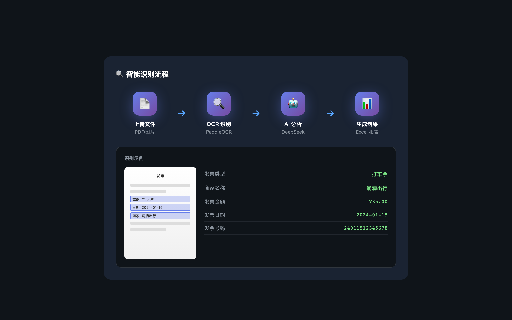
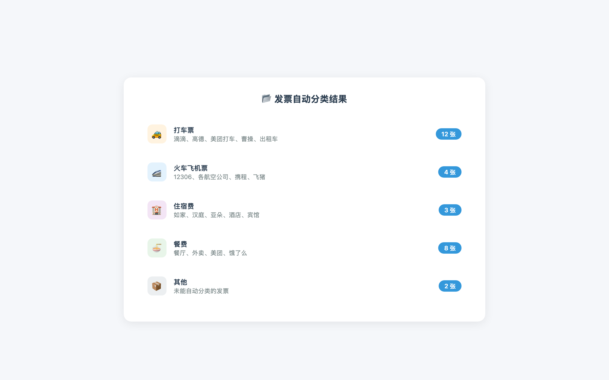
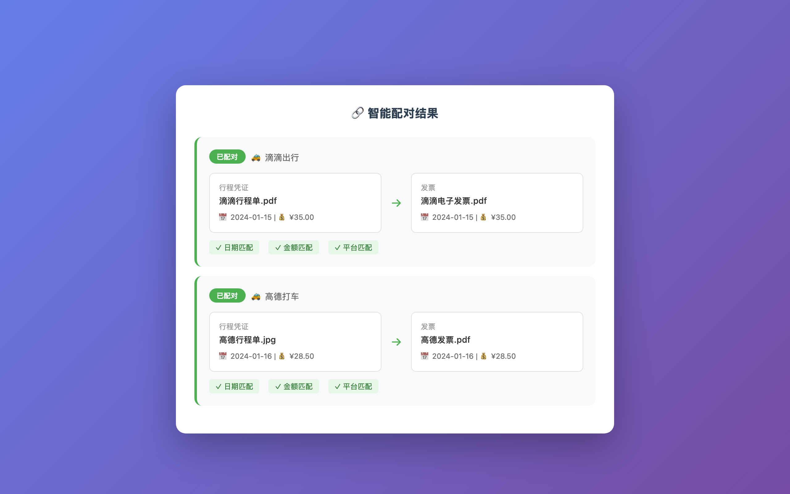
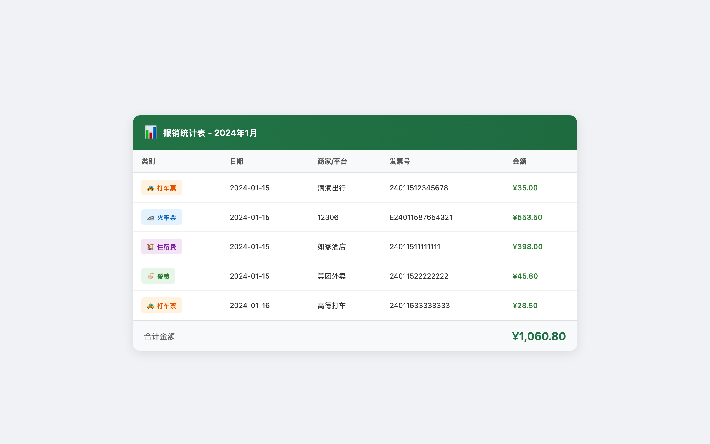
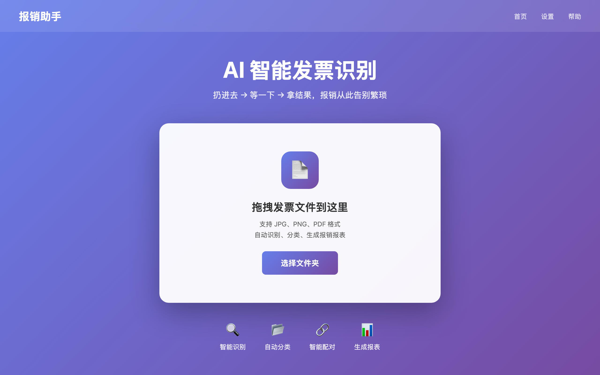
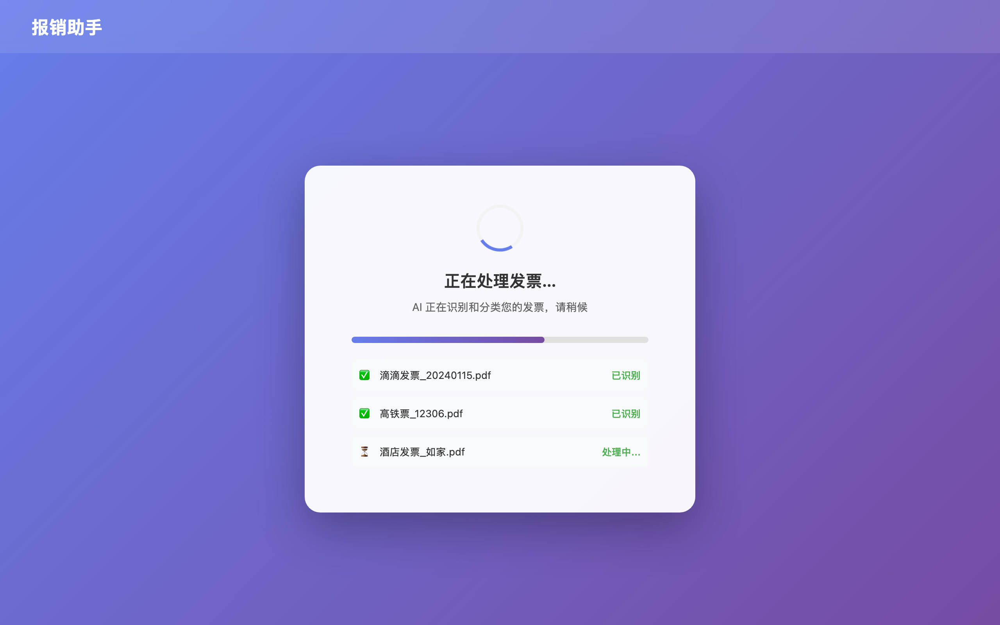
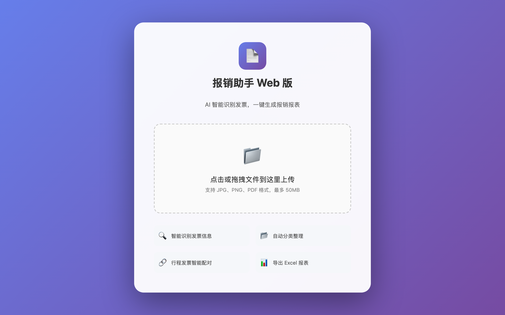
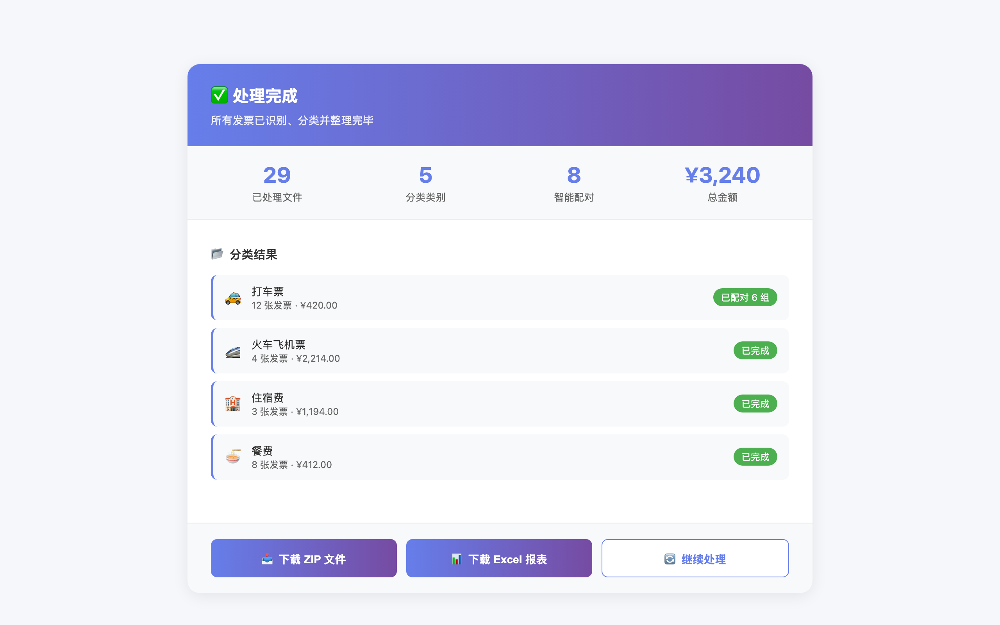
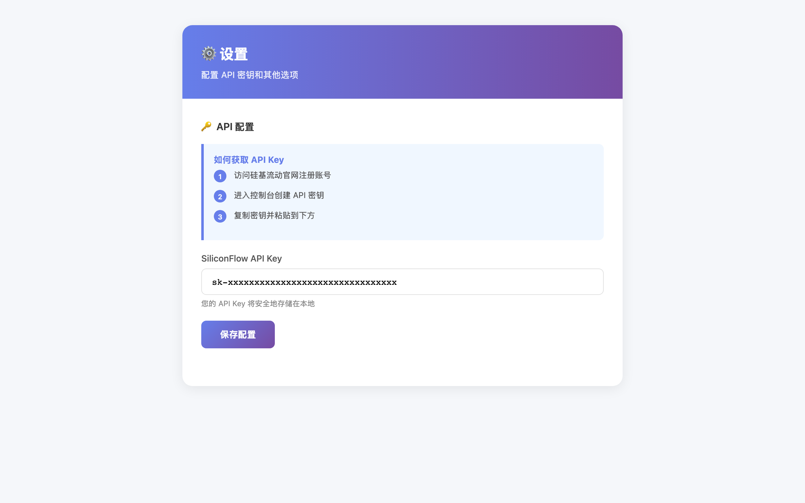

<div align="center">

# Expense Reimbursement Assistant
> AI-Powered Invoice Recognition & Reimbursement Assistant · 智能发票识别与报销整理工具


### Drop → Wait → Get Results · Say Goodbye to Reimbursement Hassles


[Features](#-features) • [Screenshots](#-screenshots) • [Quick Start](#-quick-start) • [Download](#-download) • [Architecture](#-architecture)

[简体中文](./README.md) | __English__

---
</div>

## Introduction

**Expense Reimbursement Assistant** is an AI-powered invoice recognition and reimbursement organization tool designed for professionals who frequently travel and face large volumes of invoices.

Tired of dealing with piles of invoices after every business trip? Let the Reimbursement Assistant do it for you! Simply drag and drop invoice images or PDFs into the app, and AI will automatically recognize invoice types, extract key information, intelligently pair related documents, and generate Excel reports ready for reimbursement.

### Why Choose Reimbursement Assistant?

| Traditional Method | Reimbursement Assistant |
|-------------------|-------------------------|
| Manual organization, time-consuming | AI auto-recognition, seconds to process |
| Easy to miss or mismatch documents | Smart pairing, accurate linking |
| Manual Excel entry, prone to errors | Auto-generated reports, accurate data |
| Inconsistent formats across platforms | Unified organization, standardized output |

## Features

### 1. Intelligent Recognition
Supports multiple invoice formats with automatic key information extraction:

- **Multi-format Support**: JPG, PNG images, PDF documents
- **Full Type Coverage**: Handles both scanned and electronic invoices
- **Precise Extraction**: Amount, date, merchant, invoice number, tax number, etc.



### 2. Auto-Classification
AI automatically categorizes invoices into five categories:

| Category | Recognition Range | Icon |
|----------|------------------|------|
| Taxi | Didi, Gaode, Meituan Taxi, Caocao, Taxis | 🚕 |
| Train/Flight | 12306, Airlines, Ctrip, Fliggy | 🚄 ✈️ |
| Accommodation | Hotels, Inns (Home Inn, Hanting, Atour, etc.) | 🏨 |
| Meals | Restaurants, Food delivery, Meituan, Ele.me | 🍜 |
| Others | Unrecognized invoices | 📦 |



### 3. Smart Pairing
Ride-hailing often involves two documents: "trip receipt + invoice". The system intelligently pairs them:

- ✅ Recognizes vouchers and invoices from the same platform
- ✅ Matches similar dates (±1 day)
- ✅ Matches similar amounts (±5%)
- ✅ Places paired documents in the same folder



### 4. Report Generation
Automatically generates professional Excel reimbursement reports:

- **Summary Sheet**: Category subtotals + total amount
- **Detail Sheet**: Detailed information for each invoice
- **Ready to Use**: No secondary organization needed, submit directly to finance



### 5. Multi-Platform Support
Three usage methods for different scenarios:

| Platform | Features | Use Case |
|----------|----------|----------|
| 💻 Desktop App | macOS (DMG), Windows (EXE) | Daily use, full features |
| 🌐 Web Version | Browser access, no installation | Temporary use, cross-device |
| ⌨️ Command Line | Batch processing, automation | Technical users, bulk processing |


## Screenshots

### Desktop Interface

| Home | Settings | Processing |
|------|----------|------------|
|  |  |  |

### Web Interface

| Upload Page | Results |
|-------------|---------|
|  |  |

## Download

### Option 1: Download from Releases (Recommended)

No Python installation required, ready to use out of the box!

1. Visit the [Releases page](https://github.com/frankfika/ExpenseReimbursement/releases)
2. Download the package for your platform:

| Platform | Filename | Size | Download |
|----------|----------|------|----------|
| 🍎 macOS | `ExpenseAssistant-1.2.0.dmg` | ~300 MB | [Download](https://github.com/frankfika/ExpenseReimbursement/releases/download/v1.2.0/ExpenseAssistant-1.2.0.dmg) |
| 🪟 Windows | `ExpenseHelper-1.2.0-windows.exe` | ~150 MB | [Download](https://github.com/frankfika/ExpenseReimbursement/releases/download/v1.2.0/ExpenseHelper-1.2.0-windows.exe) |

3. Install and run. API Key configuration will be guided on first launch.

### Option 2: Run from Source

```bash
# Clone the repository
git clone https://github.com/frankfika/ExpenseReimbursement.git
cd ExpenseReimbursement

# Install dependencies
pip3 install -r requirements.txt

# Run desktop version
python3 main.py

# Or run web version
python3 main.py --web

# Or run CLI version
python3 main.py --cli -i ./invoices -o ./results
```

## Quick Start

### Workflow

```
┌─────────────┐    ┌─────────────┐    ┌─────────────┐
│   Upload    │ →  │ AI Process  │ →  │  Download   │
│  (Drag/Drop)│    │(Auto-Pair)  │    │ (ZIP+Excel) │
└─────────────┘    └─────────────┘    └─────────────┘
```

### Step 1: Configure API Key

Using the SiliconFlow LLM API:

1. Visit https://cloud.siliconflow.cn/i/Wd45d1wI to register
2. Click "API Keys" and create a new key
3. Paste the key when prompted on first run, it will be saved automatically



### Step 2: Upload Invoices

- **Desktop**: Drag files to the window, or click to select folder
- **Web**: Click upload area to select files
- **CLI**: Specify input directory `-i ./invoices`

### Step 3: Get Results

After processing, the organized ZIP file will be downloaded automatically:

```
Reimbursement_Results_20240114/
├── Taxi/
│   └── 2024-01-15_Didi_35.00CNY/
│       ├── 01_Voucher_Didi_35.00CNY.jpg
│       └── 02_Invoice_Didi_35.00CNY.pdf
├── Train_Flight/
├── Accommodation/
├── Meals/
├── Others/
└── Reimbursement_Summary_20240114.xlsx
```


## Architecture


### Tech Stack

| Category | Technology | Description |
|----------|------------|-------------|
| **OCR Engine** | PaddleOCR | Chinese text recognition |
| **AI Model** | DeepSeek-V3 | Invoice analysis via SiliconFlow |
| **PDF Processing** | PyMuPDF, pdf2image | PDF to image conversion |
| **Web Framework** | Flask | Web version backend |
| **Desktop GUI** | PyWebView | Desktop app framework |
| **Excel Generation** | openpyxl | Report generation |
| **Packaging** | PyInstaller | Executable build |

## Directory Structure

```
ExpenseReimbursement/
├── app/                   # Core modules
│   ├── config.py         # Configuration management
│   ├── ocr.py            # OCR text recognition
│   ├── analyzer.py       # AI invoice analysis
│   ├── organizer.py      # File classification
│   └── report.py         # Excel report generation
├── web/                  # Web resources
│   ├── templates/        # HTML templates
│   └── static/           # CSS/JS assets
├── tests/                # Test suite
├── releases/             # Build artifacts
├── docs/assets/          # Documentation images
├── desktop_app.py        # Desktop app entry
├── web_app.py           # Web app entry
├── main.py              # Unified entry point
└── requirements.txt     # Python dependencies
```

## Changelog

### v1.2.0 (2024-02)
- ✨ Added smart pairing feature
- ✨ Bilingual interface support (Chinese/English)
- 🐛 Improved recognition accuracy
- 💄 Enhanced UI experience

### v1.1.0 (2024-01)
- ✨ Added PDF invoice recognition
- ✨ Added web interface
- 🐛 Fixed build pipeline

### v1.0.0 (2024-01)
- 🎉 Initial release
- ✨ Invoice recognition and auto-classification
- ✨ Desktop and CLI versions

## FAQ

<details>
<summary><b>Q: First run is slow?</b></summary>

The first run requires downloading PaddleOCR models (~100MB). Please be patient. Subsequent launches will be fast.
</details>

<details>
<summary><b>Q: Recognition is inaccurate?</b></summary>

- Ensure images are clear and well-lit
- Scanned documents work better than phone photos
- Electronic PDF invoices have the highest recognition rate
- Avoid cropping invoice edges
</details>

<details>
<summary><b>Q: API call failed?</b></summary>

1. Check if API Key is entered correctly
2. Confirm network connection is working
3. Ensure your SiliconFlow account has sufficient balance (new users get free credits)
4. Check if firewall is blocking requests
</details>

<details>
<summary><b>Q: Smart pairing is inaccurate?</b></summary>

- Ensure trip receipts and invoices are from the same platform
- Check if dates are similar (within ±1 day)
- Amount difference within ±5% range
- Manual adjustment of pairing results is possible
</details>

## Contributing

Contributions are welcome! Please submit issues and pull requests.

### Development Workflow

```bash
# 1. Fork and clone
git clone https://github.com/YOUR_USERNAME/ExpenseReimbursement.git

# 2. Create branch
git checkout -b feature/your-feature

# 3. Commit changes
git commit -m "feat: add some feature"

# 4. Push branch
git push origin feature/your-feature

# 5. Create Pull Request
```

### Release Process

```bash
# 1. Update version
echo '1.2.1' > VERSION

# 2. Commit and tag
git add VERSION
git commit -m "bump: v1.2.1"
git tag v1.2.1
git push origin main --tags

# 3. GitHub Actions auto-builds Release
```

## Acknowledgments

- [PaddleOCR](https://github.com/PaddlePaddle/PaddleOCR) - Chinese OCR engine
- [DeepSeek](https://deepseek.com/) - AI large language model
- [SiliconFlow](https://siliconflow.cn/) - API service provider

## License

MIT License - See [LICENSE](./LICENSE) for details

---

<div align="center">

**Make reimbursement no longer a nightmare 📄✨**

Made with ❤️ by [frankfika](https://github.com/frankfika)

</div>
