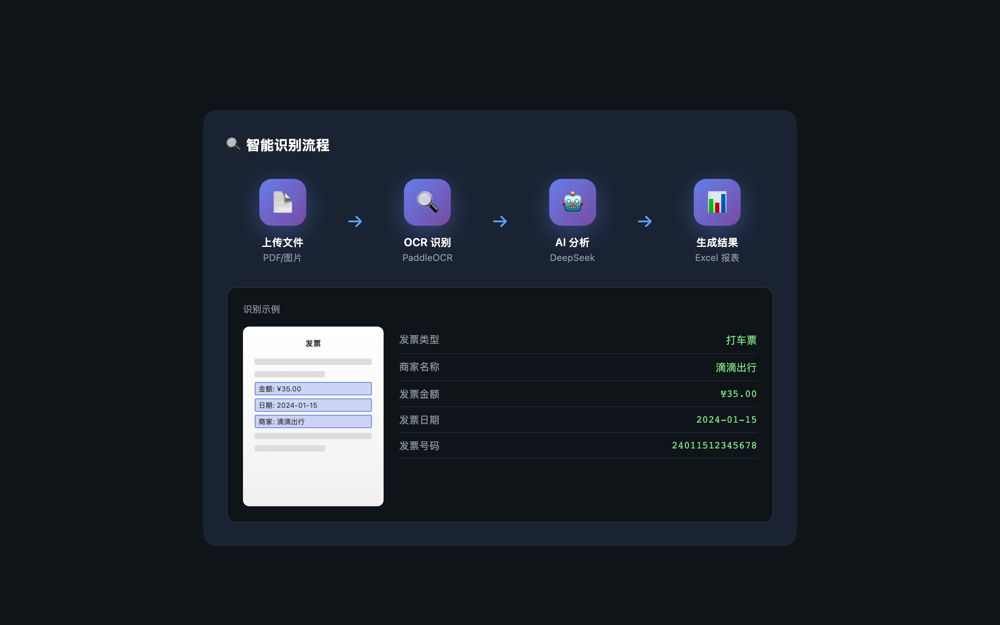
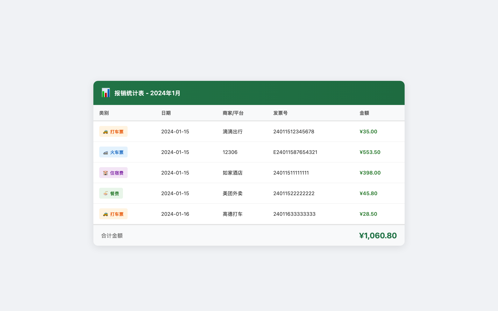
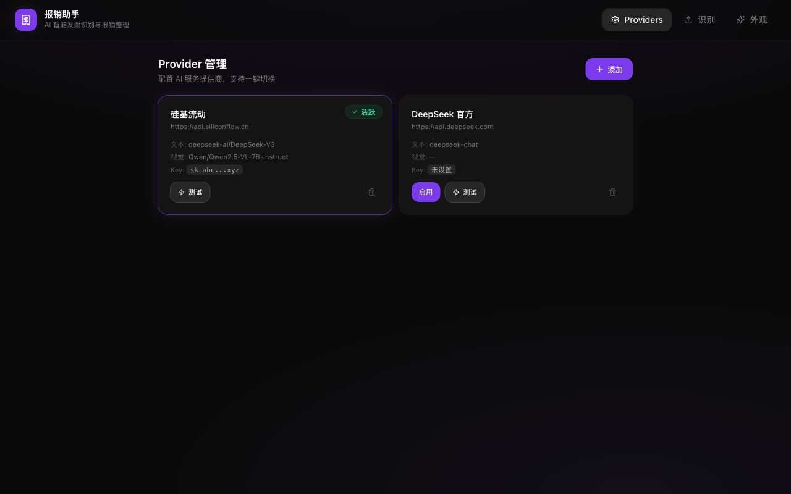
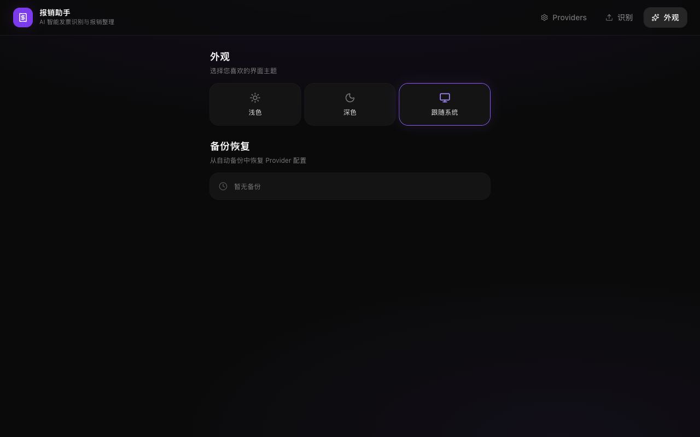
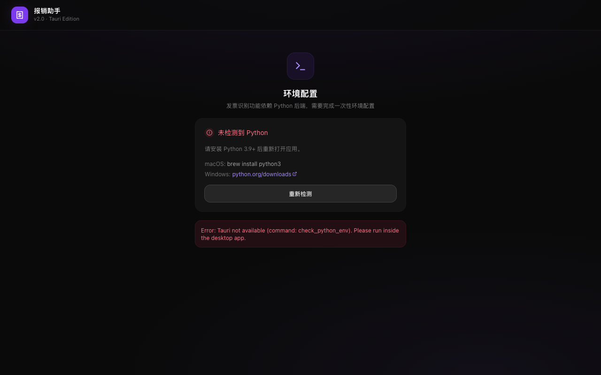
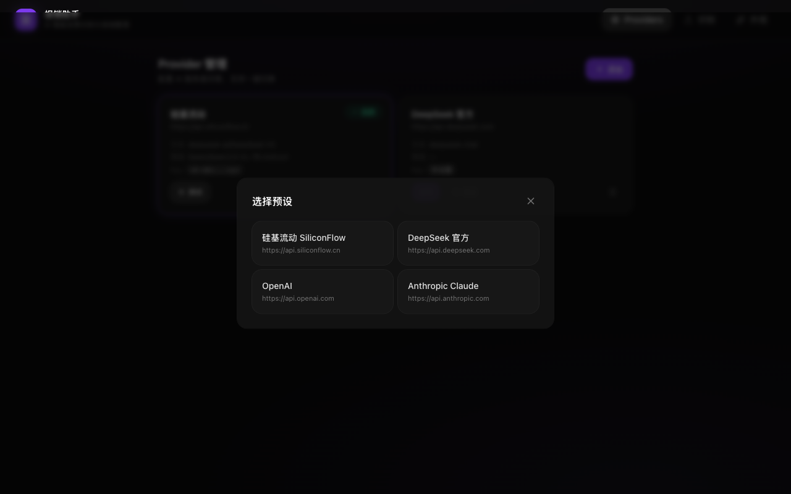
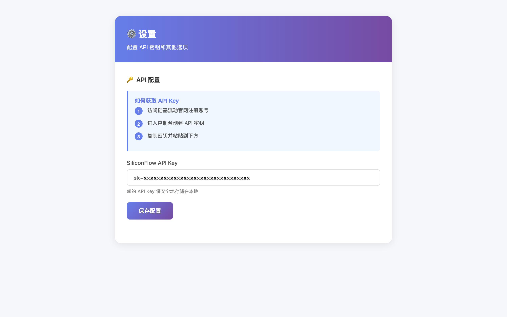
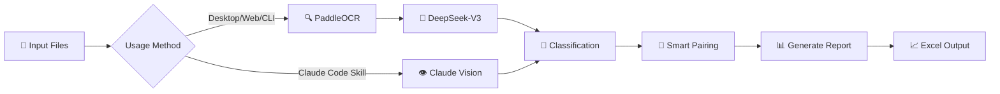

<div align="center">

# Expense Reimbursement Assistant
> AI-Powered Invoice Recognition & Reimbursement Assistant · 智能发票识别与报销整理工具


### Drop → Wait → Get Results · Say Goodbye to Reimbursement Hassles


[Features](#-features) • [Screenshots](#-screenshots) • [Quick Start](#-quick-start) • [Download](#-download) • [Architecture](#-architecture)

[简体中文](./README.md) | __English__

---
</div>

## Introduction

**Expense Reimbursement Assistant** is an AI-powered invoice recognition and reimbursement organization tool designed for professionals who frequently travel and face large volumes of invoices.

Tired of dealing with piles of invoices after every business trip? Let the Reimbursement Assistant do it for you! Simply drag and drop invoice images or PDFs into the app, and AI will automatically recognize invoice types, extract key information, intelligently pair related documents, and generate Excel reports ready for reimbursement.

### Why Choose Reimbursement Assistant?

| Traditional Method | Reimbursement Assistant |
|-------------------|-------------------------|
| Manual organization, time-consuming | AI auto-recognition, seconds to process |
| Easy to miss or mismatch documents | Smart pairing, accurate linking |
| Manual Excel entry, prone to errors | Auto-generated reports, accurate data |
| Inconsistent formats across platforms | Unified organization, standardized output |

## Features

### 1. Intelligent Recognition
Supports multiple invoice formats with automatic key information extraction:

- **Multi-format Support**: JPG, PNG images, PDF documents
- **Full Type Coverage**: Handles both scanned and electronic invoices
- **Precise Extraction**: Amount, date, merchant, invoice number, tax number, etc.



### 2. Auto-Classification
AI automatically categorizes invoices into five categories:

| Category | Recognition Range | Icon |
|----------|------------------|------|
| Taxi | Didi, Gaode, Meituan Taxi, Caocao, Taxis | 🚕 |
| Train/Flight | 12306, Airlines, Ctrip, Fliggy | 🚄 ✈️ |
| Accommodation | Hotels, Inns (Home Inn, Hanting, Atour, etc.) | 🏨 |
| Meals | Restaurants, Food delivery, Meituan, Ele.me | 🍜 |
| Others | Unrecognized invoices | 📦 |


### 3. Smart Pairing
Ride-hailing often involves two documents: "trip receipt + invoice". The system intelligently pairs them:

- ✅ Recognizes vouchers and invoices from the same platform
- ✅ Matches similar dates (±1 day)
- ✅ Matches similar amounts (±5%)
- ✅ Places paired documents in the same folder


### 4. Report Generation
Automatically generates professional Excel reimbursement reports:

- **Summary Sheet**: Category subtotals + total amount
- **Detail Sheet**: Detailed information for each invoice
- **Ready to Use**: No secondary organization needed, submit directly to finance



### 5. Multi-Platform Support
Three usage methods for different scenarios:

| Platform | Features | Use Case |
|----------|----------|----------|
| 💻 Desktop App | macOS (DMG), Windows (EXE) | Daily use, full features |
| 🌐 Web Version | Browser access, no installation | Temporary use, cross-device |
| ⌨️ Command Line | Batch processing, automation | Technical users, bulk processing |
| 🤖 Claude Code Skill | Conversational interaction, zero-config | Claude Code users, AI-native experience |


## Claude Code Skill

> 🆕 New way: Complete reimbursement tasks via natural language in the terminal, no API Key needed, zero configuration.

Expense Reimbursement Assistant provides a [Claude Code](https://docs.anthropic.com/en/docs/claude-code) Skill that leverages Claude's native vision capabilities to recognize invoices directly, without relying on PaddleOCR or external APIs.

### Install

```bash
# Copy the skill to Claude Code skills directory
cp -r claude-skill ~/.claude/skills/expense-reimbursement
```

### Usage

In Claude Code, simply say:

```
Help me organize invoices in ~/Desktop/invoices
```

Or any instruction containing "reimbursement", "invoice", "organize invoices", or "expense report" will automatically trigger it.

### Workflow

```
📁 Specify invoice folder
  ↓
👁️ Claude views each image/PDF (multimodal vision)
  ↓
🏷️ Auto-classification (Taxi / Train-Flight / Accommodation / Meals / Others)
  ↓
🔗 Smart pairing (trip receipt + invoice → same folder)
  ↓
📂 Organize into standard directory structure
  ↓
📊 Generate Excel reimbursement report
```

### Comparison

| Feature | Desktop/Web/CLI | Claude Code Skill |
|---------|----------------|-------------------|
| OCR Engine | PaddleOCR (~100MB install) | Claude native vision |
| AI Analysis | SiliconFlow API (Key needed) | Claude itself (zero-config) |
| Python Dependencies | 10+ packages | Only openpyxl (auto-installed) |
| Interaction | GUI / Web / CLI | Natural language conversation |
| Target Users | All users | Claude Code users |

---

## Interface Guide

### Desktop App (v2.0.3 Dark Theme)

| Provider Management | Invoice Recognition | Appearance Settings |
|--------------------|--------------------|--------------------|
|  |  |  |

| First-Run Wizard | Add Provider |
|------------------|-------------|
|  |  |

### Web Interface

| Upload Page | Results |
|-------------|---------|
|  |  |

## Download

### Option 1: Download from Releases (Recommended)

Small size (4–6 MB), built with Tauri v2.

> **Prerequisite**: Invoice recognition requires Python 3.9+ installed on your system. The app will automatically detect and guide installation of Python dependencies on first launch — no manual commands needed.

1. Visit the [Releases page](https://github.com/frankfika/ExpenseReimbursement/releases/latest)
2. Download the package for your platform:

| Platform | Filename | Size | Download |
|----------|----------|------|----------|
| 🍎 macOS (Apple Silicon) | `ExpenseHelper_2.0.3_aarch64.dmg` | ~6 MB | [Download](https://github.com/frankfika/ExpenseReimbursement/releases/download/v2.0.3/ExpenseHelper_2.0.3_aarch64.dmg) |
| 🍎 macOS (Intel) | `ExpenseHelper_2.0.3_x64.dmg` | ~6 MB | [Download](https://github.com/frankfika/ExpenseReimbursement/releases/download/v2.0.3/ExpenseHelper_2.0.3_x64.dmg) |
| 🪟 Windows (x64) | `ExpenseHelper_2.0.3_x64-setup.exe` | ~4 MB | [Download](https://github.com/frankfika/ExpenseReimbursement/releases/download/v2.0.3/ExpenseHelper_2.0.3_x64-setup.exe) |

3. Install and run, then configure Provider and API Key in Settings.

> **macOS users**: Not code-signed. If you see "damaged" warning on first open, run `xattr -cr /Applications/ExpenseHelper.app` in terminal.
>
> **Windows users**: Not code-signed. Click "More info → Run anyway" on SmartScreen warning.

### Option 2: Claude Code Skill (Zero Config)

```bash
git clone https://github.com/frankfika/ExpenseReimbursement.git
cp -r ExpenseReimbursement/claude-skill ~/.claude/skills/expense-reimbursement
```

Then say "help me organize invoices" in Claude Code — no API Key needed.

### Option 3: Run from Source

```bash
# Clone the repository
git clone https://github.com/frankfika/ExpenseReimbursement.git
cd ExpenseReimbursement

# Install dependencies
pip3 install -r requirements.txt

# Run desktop version
python3 main.py

# Or run web version
python3 main.py --web

# Or run CLI version
python3 main.py --cli -i ./invoices -o ./results
```

## Quick Start

### Workflow

```
┌─────────────┐    ┌─────────────┐    ┌─────────────┐
│   Upload    │ →  │ AI Process  │ →  │  Download   │
│  (Drag/Drop)│    │(Auto-Pair)  │    │ (ZIP+Excel) │
└─────────────┘    └─────────────┘    └─────────────┘
```

### Step 1: Configure API Key

Using the SiliconFlow LLM API:

1. Visit https://cloud.siliconflow.cn/i/Wd45d1wI to register
2. Click "API Keys" and create a new key
3. Paste the key when prompted on first run, it will be saved automatically



### Step 2: Upload Invoices

- **Desktop**: Drag files to the window, or click to select folder
- **Web**: Click upload area to select files
- **CLI**: Specify input directory `-i ./invoices`

### Step 3: Get Results

After processing, the organized ZIP file will be downloaded automatically:

```
Reimbursement_Results_20240114/
├── Taxi/
│   └── 2024-01-15_Didi_35.00CNY/
│       ├── 01_Voucher_Didi_35.00CNY.jpg
│       └── 02_Invoice_Didi_35.00CNY.pdf
├── Train_Flight/
├── Accommodation/
├── Meals/
├── Others/
└── Reimbursement_Summary_20240114.xlsx
```


## Architecture


```mermaid
graph LR
    A[📁 Input Files] --> B{Usage Method}
    B -->|Desktop/Web/CLI| C[🔍 PaddleOCR]
    B -->|Claude Code Skill| F[👁️ Claude Vision]
    C --> D[🤖 DeepSeek-V3]
    D --> E[📂 Classification]
    F --> E
    E --> G[🔗 Smart Pairing]
    G --> H[📊 Generate Report]
    H --> I[📈 Excel Output]
```

### Tech Stack

| Category | Technology | Description |
|----------|------------|-------------|
| **OCR Engine** | PaddleOCR / Claude Vision | Chinese text recognition |
| **AI Model** | DeepSeek-V3 / Claude | Invoice analysis |
| **PDF Processing** | PyMuPDF, pdf2image | PDF to image conversion |
| **Web Framework** | Flask | Web version backend |
| **Desktop GUI** | Tauri v2 + React + Rust | Desktop app framework |
| **Excel Generation** | openpyxl | Report generation |
| **Packaging** | Tauri Bundler | DMG / NSIS builds |

## Directory Structure

```
ExpenseReimbursement/
├── app/                    # Core modules
│   ├── config.py          # Configuration management
│   ├── ocr.py             # OCR text recognition
│   ├── analyzer.py        # AI invoice analysis
│   ├── organizer.py       # File classification
│   └── report.py          # Excel report generation
├── claude-skill/          # Claude Code Skill
│   ├── SKILL.md           # Skill definition and workflow
│   └── scripts/           # Report generation scripts
│       └── generate_report.py
├── tauri-app/             # Tauri v2 desktop app
│   ├── src/               # React frontend
│   └── src-tauri/         # Rust backend
├── web/                   # Web resources
│   ├── templates/         # HTML templates
│   └── static/            # CSS/JS assets
├── tests/                 # Test suite
├── releases/              # Build artifacts
├── docs/assets/           # Documentation images
├── desktop_app.py         # Desktop app entry (legacy)
├── web_app.py            # Web app entry
├── main.py               # Unified entry point
└── requirements.txt      # Python dependencies
```

## Changelog

### v2.0.3 (2026-05)
- 💄 New dark theme UI: referencing bolt.new modern developer tool style, purple accent + glassmorphism cards
- 📸 Updated README screenshots to reflect new design

### v2.0.2 (2026-05)
- ✨ First-run environment setup wizard: auto-detect Python, one-click venv creation and dependency install
- 🐛 Fixed Tauri app unable to find Python backend (sidecar path resolved from resource_dir)
- 🐛 Fixed Windows MSI bundling failure (switched to NSIS)
- 🐛 Fixed GitHub Release asset Chinese filename truncation (artifacts renamed to English)

### v2.0.0 (2026-05)
- Desktop app rewritten with Tauri v2 + React + Rust, installer size reduced from 150-300 MB to 4-6 MB
- Multi-Provider configuration management (one-click switch between SiliconFlow / self-hosted / other OpenAI-compatible services)
- macOS dual-architecture DMG: Apple Silicon (aarch64) + Intel (x64)
- Legacy PyInstaller desktop entry (`desktop_app.py`) kept as optional source-run method

### v1.3.0 (2026-03)
- 🤖 Added Claude Code Skill for conversational reimbursement organization
- ✨ Leverages Claude native vision capabilities, no external API needed
- 📦 Zero-config installation, only openpyxl dependency required

### v1.2.0 (2026-02)
- ✨ Added smart pairing feature
- ✨ Bilingual interface support (Chinese/English)
- 🐛 Improved recognition accuracy
- 💄 Enhanced UI experience

### v1.1.0 (2026-01)
- ✨ Added PDF invoice recognition
- ✨ Added web interface
- 🐛 Fixed build pipeline

### v1.0.0 (2026-01)
- 🎉 Initial release
- ✨ Invoice recognition and auto-classification
- ✨ Desktop and CLI versions

## FAQ

<details>
<summary><b>Q: First run is slow?</b></summary>

The first run requires downloading PaddleOCR models (~100MB). Please be patient. Subsequent launches will be fast.

> Using Claude Code Skill requires no model download, works out of the box.
</details>

<details>
<summary><b>Q: Recognition is inaccurate?</b></summary>

- Ensure images are clear and well-lit
- Scanned documents work better than phone photos
- Electronic PDF invoices have the highest recognition rate
- Avoid cropping invoice edges
</details>

<details>
<summary><b>Q: API call failed?</b></summary>

1. Check if API Key is entered correctly
2. Confirm network connection is working
3. Ensure your SiliconFlow account has sufficient balance (new users get free credits)
4. Check if firewall is blocking requests

> Using Claude Code Skill does not require configuring an API Key.
</details>

<details>
<summary><b>Q: Smart pairing is inaccurate?</b></summary>

- Ensure trip receipts and invoices are from the same platform
- Check if dates are similar (within ±1 day)
- Amount difference within ±5% range
- Manual adjustment of pairing results is possible
</details>

## Contributing

Contributions are welcome! Please submit issues and pull requests.

### Development Workflow

```bash
# 1. Fork and clone
git clone https://github.com/YOUR_USERNAME/ExpenseReimbursement.git

# 2. Create branch
git checkout -b feature/your-feature

# 3. Commit changes
git commit -m "feat: add some feature"

# 4. Push branch
git push origin feature/your-feature

# 5. Create Pull Request
```

### Release Process

```bash
# 1. Update Tauri version
# Edit tauri-app/src-tauri/tauri.conf.json and Cargo.toml
# Change version to new version

# 2. Commit and tag
git commit -am "release: v2.x.x"
git tag v2.x.x
git push origin main --tags

# 3. GitHub Actions auto-builds and publishes Release
#    (macOS aarch64/x64 + Windows x64)
```

## Acknowledgments

- [PaddleOCR](https://github.com/PaddlePaddle/PaddleOCR) - Chinese OCR engine
- [DeepSeek](https://deepseek.com/) - AI large language model
- [SiliconFlow](https://siliconflow.cn/) - API service provider
- [Claude Code](https://docs.anthropic.com/en/docs/claude-code) - AI-native development tool

## License

MIT License - See [LICENSE](./LICENSE) for details

---

<div align="center">

**Make reimbursement no longer a nightmare 📄✨**

Made with ❤️ by [frankfika](https://github.com/frankfika)

</div>
